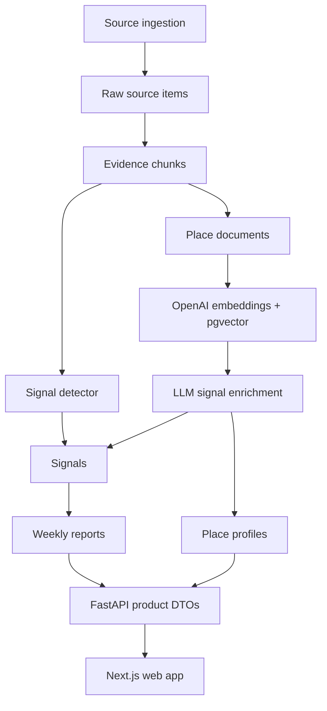

# LocalSignal System Architecture

## Product Goal

LocalSignal turns local restaurant activity into evidence-backed intelligence:

- what changed nearby
- why the change is happening
- which food/place context makes the signal believable
- what evidence supports the read

The product surface is intentionally not a generic review browser. The moat is the signal detail page: retrieved place context plus fresh evidence compressed into a clear read.

## System Layers



## Data Flow

1. Ingestion writes normalized source material into `raw_source_items`, `mentions`, and `evidence_chunks`.
2. The signal engine ranks candidate changes and writes published rows into `signals`.
3. `run_place_knowledge` converts existing evidence, Google/place details, and website text into `place_documents`.
4. The food intelligence builder extracts source-backed facts into `place_food_facts`.
5. `place_documents.embedding` stores OpenAI `text-embedding-3-small` vectors in pgvector.
6. LLM enrichment retrieves the most relevant `place_documents` for a place/signal and writes:
   - signal-local food interpretation into `signals.evidence.food_signal`
   - durable place identity into `place_profiles`
7. Report generation writes `reports`, `report_signals`, and `reports.briefing`.
8. FastAPI returns product-shaped DTOs. The web app should not need to know database internals.

## Source Of Truth

`places`

Canonical identity, location, map metadata, Google place id, and category.

`place_documents`

Retrieval corpus. This is where review snippets, evidence chunks, Google context, official descriptions, website/menu text, and profile-like source material live before LLM compression.

`official_description` documents are context-only. They can anchor what a place says about itself or how a platform describes it, but they do not prove recent momentum, demand, sentiment, or popularity.

`place_profiles`

Durable profile summary for a place. API responses should prefer this table over old snapshots inside `signals.evidence.place_profile`.

`place_food_facts`

Source-backed food facts extracted from reviews, menus, websites, and signal evidence. Each fact has a type (`dish`, `occasion`, or `behavior`), a value, the exact evidence text, source metadata, timestamp, confidence, and provenance. This is the evidence layer for future Food-Level Reads.

`signals`

The signal record: title, score, confidence, metrics, status, and signal-local evidence JSON. `signals.evidence.food_signal` is still signal-local because it changes with the particular trend being explained.

`signal_evidence`

Ranked links from signals to the evidence chunks that justify the signal.

`reports`

Weekly narrative packaging. `reports.briefing` is report-level copy, not the canonical place profile.

## Retrieval And LLM Design

The current RAG path is intentionally lightweight:

- no LangChain dependency
- no PyTorch runtime
- OpenAI embeddings through `text-embedding-3-small`
- pgvector storage and cosine search
- direct Python orchestration in `localsignal_engine.place_knowledge`

This is the right shape for the current product stage because the corpus is small and the retrieval contract is simple. LangChain can be added later if we need multi-step chains, tool routing, or provider abstraction. PyTorch is unnecessary unless we host local embedding/ranking models.

## Detail Page Contract

The detail page should read like compressed intelligence, not a dashboard:

- Hero: place, category, city, timeframe
- Signal read: what changed and whether it looks structural or temporary
- Food signal: LLM summary of the food/place-specific reason this signal matters
- Place profile: durable identity from `place_profiles`
- Why this signal happened: evidence-backed drivers
- Trend chart: simple signal strength over time
- Nearby context: Google map and nearby cluster
- Evidence: expandable snippets, not a full review list

Old concepts such as generic pace language, comparison filler, or broad “why it matters” copy should stay out unless they are backed by retrieval.

## Operational Commands

Local:

```bash
make evidence-ingestion
make place-knowledge
make report
```

Docker:

```bash
make docker-evidence
make docker-place-knowledge
make docker-report
```

The intended refresh loop is:

1. ingest source evidence
2. generate candidate weekly signals from the current/baseline windows
3. refresh place knowledge for only the places that appear in the report
4. build/update food intelligence, restaurant briefs, and embeddings for those places
5. generate signal enrichments and digest output
6. verify homepage and signal detail pages

The weekly job now calls the place-knowledge layer after `write_weekly_report()` and `link_evidence_chunks_to_signals()`. This means `Restaurant Brief` data is produced during scheduled report generation, not lazily from the signal detail page. The refresh is scoped to the places in that week's report so stable restaurant context stays current without reprocessing the entire place table every cycle.

The scheduler container must carry the same LLM-related environment as ad-hoc engine jobs:

- `OPENAI_API_KEY`
- `OPENAI_MODEL`
- `OPENAI_EMBEDDING_MODEL`
- `PLACE_KNOWLEDGE_WEEKLY_ENABLED`
- `PLACE_KNOWLEDGE_GOOGLE_ENABLED`
- `PLACE_KNOWLEDGE_WEBSITE_ENABLED`
- `PLACE_KNOWLEDGE_EMBED_ENABLED`

## Current Debt

- `signals.evidence` still carries several product fields. Keep `food_signal` there for now, but avoid adding more durable place facts to it.
- `llm.py` owns prompts, validation, repair, fallback, briefing, food signal, and profile logic. Split it once the product contract stabilizes.
- `place_documents` has the vector index; `evidence_chunks.embedding` and `mentions.embedding` are available but not yet part of the active retrieval path.
- `official_description` exists to enrich place identity, but the UI still needs a cleaner split between official context, recent signal evidence, and food facts.
- `place_food_facts` starts as term extraction plus source spans. It should become more semantic over time, likely with LLM-assisted extraction and better confidence scoring.
- API still performs some fallback shaping for older rows. New code should move durable intelligence into tables first, then have API expose it cleanly.
- Briefing guardrails are separate from signal detail guardrails and may still need dedicated prompt tuning.

## Near-Term Architecture Direction

1. Keep `place_profiles` as the canonical place profile source.
2. Keep `place_food_facts` as the canonical food evidence layer.
3. Keep signal-specific LLM reads inside `signals.evidence.food_signal` until a `signal_insights` table is worth the extra schema.
4. Keep `place_documents` as the active RAG corpus, with `food_intelligence` packets generated from facts rather than treated as ground truth.
5. Prefer explicit SQL/Python orchestration over a framework until retrieval becomes multi-hop or multi-agent.
6. Treat the web app as a rendering layer. Product intelligence should arrive through API DTOs, not be invented in React.
