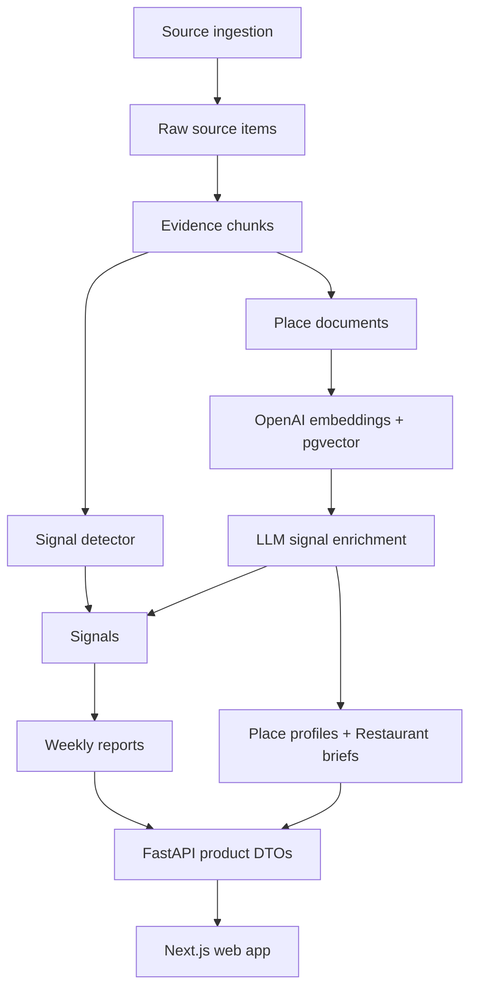

# LocalSignal System Architecture

## Product Goal

LocalSignal turns local restaurant activity into evidence-backed intelligence:

- what changed nearby
- why the change is happening
- which food/place context makes the signal believable
- what evidence supports the read

The product surface is intentionally not a generic review browser. The moat is the signal detail page: retrieved place context plus fresh evidence compressed into a clear read.

## System Layers



## Data Flow

1. Ingestion writes normalized source material into `raw_source_items`, `mentions`, and `evidence_chunks`.
2. The signal engine ranks candidate changes and writes published rows into `signals`.
3. `run_place_knowledge` converts existing evidence, Google/place details, and website text into `place_documents`.
4. `build_restaurant_brief_documents` uses GPT-4o with `web_search_preview` to generate a structured restaurant brief per place, stored in `place_documents` with `content_type='restaurant_brief'`. The structured JSON is stored in `place_documents.metadata`; a text version is stored in `place_documents.content` for RAG retrieval.
5. `place_documents.embedding` stores OpenAI `text-embedding-3-small` vectors in pgvector.
6. LLM enrichment retrieves the most relevant `place_documents` for a place/signal and writes signal-local food interpretation into `signals.evidence.food_signal`.
7. Report generation writes `reports`, `report_signals`, and `reports.briefing`.
8. FastAPI returns product-shaped DTOs. The web app should not need to know database internals.

## Two Knowledge Domains

The system maintains two distinct knowledge domains, both stored in the same PostgreSQL instance:

### Place Knowledge (static)

Describes **what a place is** — independent of time, updated periodically.

| Table | Purpose |
|---|---|
| `places` | Canonical identity, location, map metadata |
| `place_documents` | Retrieval corpus: crawled docs, menus, official descriptions, and LLM-generated briefs |
| `place_profiles` | Durable summary: known_for, food_types, signature_items, flavor_cues, occasions |
| `baseline_profiles` | Historical heat scores and trailing mention counts |

`place_documents` with `content_type='restaurant_brief'` is the primary source for the "About this place" section. The `metadata` column carries the structured brief (JSON) and `content` carries a text version for embedding/RAG.

### Signal Knowledge (temporal)

Describes **what happened this week** at a place — time-windowed, generated weekly.

| Table | Purpose |
|---|---|
| `signals` | Weekly signal record with score, confidence, and evidence JSON |
| `evidence_chunks` | Source-backed review/mention snippets, vectorized |
| `signal_evidence` | Ranked links from signals to evidence chunks |

`signals.evidence.food_signal` is the primary source for the "What's moving this week" section.

`evidence_chunks` is shared: Place Knowledge queries the full history; Signal queries the current week window only.

## Source Of Truth

`places`

Canonical identity, location, map metadata, Google place id, and category.

`place_documents`

Retrieval corpus. Holds review snippets, evidence chunks, Google context, official descriptions, website/menu text, and LLM-generated restaurant briefs. Restaurant briefs (`content_type='restaurant_brief'`) are produced by `build_restaurant_brief_documents()` and stored with full structured JSON in `metadata`.

`place_profiles`

Durable profile summary for a place. API responses should prefer this table over old snapshots inside `signals.evidence.place_profile`.

`signals`

The signal record: title, score, confidence, metrics, status, and signal-local evidence JSON. `signals.evidence.food_signal` is signal-local because it changes with the particular trend being explained.

`signal_evidence`

Ranked links from signals to the evidence chunks that justify the signal.

`reports`

Weekly narrative packaging. `reports.briefing` is report-level copy, not the canonical place profile.

## Restaurant Brief

Generated by `localsignal_engine.place_knowledge.build_restaurant_brief_documents()`.

**Model:** `gpt-4o` (configured via `OPENAI_MODEL_RICH`, default `gpt-4o`)

**Retrieval:** Uses `web_search_preview` tool to search `"{place_name} {city} restaurant"` in addition to official documents and menu facts from `place_documents`.

**Output shape:**

```python
{
  "what_it_is": str,              # 2-3 sentence description
  "official_context_note": str,   # stable official context
  "signature_menu_items": [str],  # up to 8 items, "Name: description" format
  "highlight_items": [            # up to 4 distinctive aspects
    {"aspect": str, "detail": str}
  ],
  "location_format": str,         # "Neighborhood · category"
  "vibe_tags": [str],             # up to 5 atmosphere tags
  "occasions": [str],             # up to 4 use cases
  "source_chips": [str],          # provenance labels
  "trust_note": str,              # context-only disclaimer
}
```

The brief is stored in `place_documents.metadata` (structured JSON for API) and `place_documents.content` (text for RAG embedding). `place_documents.source` is `localsignal_restaurant_brief`.

## Food Signal

Generated per signal by `localsignal_engine.llm_signal` from `evidence_chunks` in the current week window.

**Output shape (inside `signals.evidence.food_signal`):**

```python
{
  "summary": str,          # 1-2 sentence signal narrative
  "primary_pull": str,     # what's driving attention
  "signal_dish": str,      # most-mentioned specific dish name this week
  "flavor_cue": str,       # taste/texture descriptor
  "occasion": str,         # when/why people come
  "confidence": str,       # "High" | "Medium" | "Low"
  "evidence_basis": str,   # source summary
  "image_query": str,      # image search hint
  "image_alt": str,        # accessibility text
}
```

`signal_dish` names the single most-mentioned specific dish or menu item found in evidence_chunks for that week, using the exact name as it appears in reviews.

## Detail Page Contract

The signal detail page is split into two sections:

### Section 1 — About this place
Source: `restaurant_brief` (from `place_documents.metadata`)

- Place name, cuisine label, `what_it_is` description
- `highlight_items` grid — what makes this place distinctive
- `signature_menu_items` — stable menu anchors
- Experience card: `location_format`, `vibe_tags`, `occasions`
- `source_chips` — provenance labels

Falls back to `signals.evidence.place_profile` data when `restaurant_brief` is null.

### Section 2 — What's moving this week
Source: `food_signal` (from `signals.evidence.food_signal`) + `evidence_chunks`

- Featured dish card: `signal_dish` or `primary_pull`
- Occasion context if available
- Top evidence quotes (Recent voices) with platform, timestamp, source link

Old concepts such as SignalRead, FoodSignal panel, and Food Intelligence panel have been removed. The UI reads directly from `restaurant_brief` and `food_signal` without client-side reshaping.

## Retrieval And LLM Design

The current RAG path is intentionally lightweight:

- no LangChain dependency
- no PyTorch runtime
- OpenAI embeddings through `text-embedding-3-small`
- pgvector storage and cosine search
- direct Python orchestration in `localsignal_engine.place_knowledge`
- `web_search_preview` tool for restaurant brief enrichment (requires `gpt-4o`)

This is the right shape for the current product stage because the corpus is small and the retrieval contract is simple.

## Operational Commands

Local:

```bash
make evidence-ingestion
make place-knowledge
make report
```

Docker:

```bash
make docker-evidence
make docker-place-knowledge
make docker-report
```

The intended refresh loop is:

1. ingest source evidence
2. generate candidate weekly signals from the current/baseline windows
3. refresh place knowledge for only the places that appear in the report
4. build/update restaurant briefs and embeddings for those places
5. generate signal enrichments and digest output
6. verify homepage and signal detail pages

The weekly job calls the place-knowledge layer after `write_weekly_report()` and `link_evidence_chunks_to_signals()`. `Restaurant Brief` data is produced during scheduled report generation, not lazily from the signal detail page. The refresh is scoped to the places in that week's report.

The scheduler container must carry the same LLM-related environment as ad-hoc engine jobs:

- `OPENAI_API_KEY`
- `OPENAI_MODEL` — standard model for signal enrichment (default `gpt-4.1-mini`)
- `OPENAI_MODEL_RICH` — rich model for restaurant briefs (default `gpt-4o`, required for `web_search_preview`)
- `OPENAI_EMBEDDING_MODEL`
- `PLACE_KNOWLEDGE_WEEKLY_ENABLED`
- `PLACE_KNOWLEDGE_GOOGLE_ENABLED`
- `PLACE_KNOWLEDGE_WEBSITE_ENABLED`
- `PLACE_KNOWLEDGE_EMBED_ENABLED`

## Current Debt

- `signals.evidence` still carries several product fields. Keep `food_signal` there for now, but avoid adding more durable place facts to it.
- `place_knowledge.py` owns prompts, validation, repair, brief generation, and food signal logic. Split it once the product contract stabilizes.
- `place_documents` has the vector index; `evidence_chunks.embedding` and `mentions.embedding` are available but not yet part of the active retrieval path.
- API still performs some fallback shaping for older rows. New code should move durable intelligence into tables first, then have API expose it cleanly.
- `place_food_facts` table and the `DISH_TERMS` regex extraction pipeline are deprecated. Dish discovery is now handled by `restaurant_brief.signature_menu_items` (LLM + web search) and `food_signal.signal_dish` (weekly evidence extraction).
- `place_documents` conflates input documents (crawled content) and output documents (LLM-generated briefs). Consider a dedicated `place_briefs` table when the schema stabilizes.

## Near-Term Architecture Direction

1. Keep `place_profiles` as the canonical place profile source for durable computed fields.
2. Keep restaurant briefs in `place_documents` (metadata + content) until volume warrants a dedicated table.
3. Keep signal-specific LLM reads inside `signals.evidence.food_signal` until a `signal_insights` table is worth the extra schema.
4. Keep `place_documents` as the active RAG corpus.
5. Prefer explicit SQL/Python orchestration over a framework until retrieval becomes multi-hop or multi-agent.
6. Treat the web app as a rendering layer. Product intelligence should arrive through API DTOs, not be invented in React.
