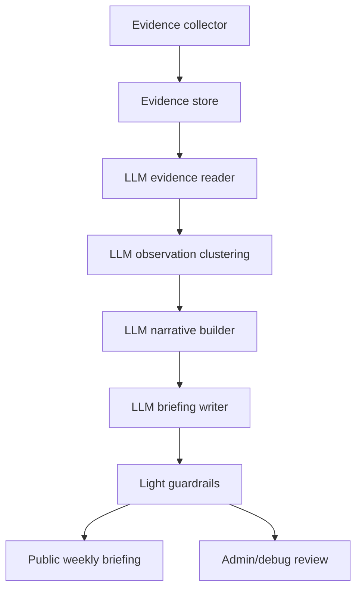

# LLM-First Local Briefing System

LocalSignal should behave like an AI local editor, not a local analytics dashboard.

The public product should answer one question:

> What changed around Fort Lee this week, and why should a local resident care?

## Product Shape

The consumer-facing page is a weekly briefing:

- One main local narrative.
- Three smaller supporting reads.
- Places involved.
- Sources collapsed by default.

The public UI should avoid internal terms like confidence, source diversity, signal type, anomaly, taxonomy, source count, repeated clue, and detection. Those belong in an admin/debug surface.

## Pipeline



## Modules

### 1. Evidence Collector

The collector gathers raw local evidence and does not decide what is important.

Initial sources:

- Google Places and reviews.
- Local news and town pages.
- Manual public links.
- Later: Reddit, Instagram metadata, TikTok metadata, event pages.

Suggested evidence shape:

```ts
type Evidence = {
  id: string;
  source_type: "google_place" | "news" | "manual" | "reddit" | "social_metadata";
  title: string;
  text: string;
  url?: string;
  place_name?: string;
  location?: string;
  category?: string;
  published_at?: string;
  collected_at: string;
};
```

### 2. LLM Evidence Reader

The reader turns raw evidence into calm observations.

```ts
type Observation = {
  claim: string;
  evidence_ids: string[];
  places: string[];
  category: string;
  strength: "weak" | "medium" | "strong";
  caveat: string;
};
```

The LLM should understand semantic patterns, not just keywords. For example, bingsu, late coffee, dessert stop, and after-dinner cafe can belong to one behavioral observation.

### 3. LLM Narrative Builder

The builder chooses what is worth saying this week.

```ts
type BriefingPlan = {
  main_story: Observation;
  supporting_reads: Observation[];
  ignored_observations: Observation[];
  reason_for_main_story: string;
};
```

The question is not "what signals exist?" The question is "what is the most useful local change to tell a resident?"

### 4. LLM Briefing Writer

The writer produces the public artifact.

```ts
type Briefing = {
  title: string;
  subtitle: string;
  why_it_matters: string;
  places_involved: Array<{
    name: string;
    area: string;
    reason: string;
  }>;
  supporting_reads: Array<{
    title: string;
    summary: string;
    evidence_ids: string[];
  }>;
  sources: Array<{
    evidence_id: string;
    label: string;
    url?: string;
  }>;
};
```

### 5. Guardrails

Rules should protect quality, not create the story.

Required checks:

- Every public claim links back to evidence.
- Do not hallucinate places, openings, dates, ratings, popularity, or social posts.
- Do not call something a trend unless there are multiple supporting pieces of evidence.
- Do not make investment, real estate, or business-strategy claims.
- Keep claims local, modest, and reversible.
- If evidence is thin, say less.

## API Direction

Public:

- `GET /api/briefings/latest`
- `GET /api/briefings/:id`
- `GET /api/briefings/:id/sources`

Admin:

- `POST /api/admin/evidence`
- `POST /api/admin/generate-briefing`
- `GET /api/admin/observations/latest`
- `GET /api/admin/briefing-runs`

## UI Direction

Public pages should feel closer to a weekly local magazine than a monitoring dashboard.

Use:

- One strong narrative.
- Short paragraphs.
- A few named places.
- Collapsed sources.

Avoid:

- Filters.
- Category watch panels.
- Confidence chips.
- Detection language.
- Dense repeated cards.
- Explanations of how the system works.

## Implementation Note

The current codebase can bridge toward this without deleting the existing signal pipeline:

- Treat existing `signals` as provisional observations.
- Use LLM-enriched fields as briefing material when present.
- Render the public homepage with `LocalBriefing`.
- Keep old signal/feed components available for an admin/debug page later.
